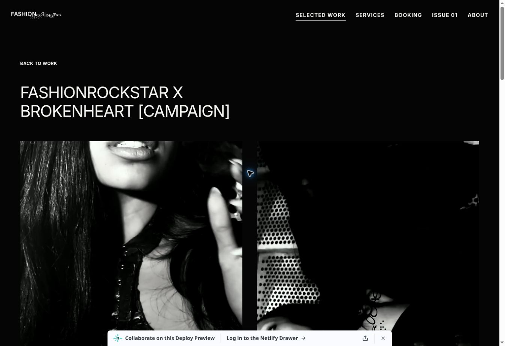

# All-project cover continuity verification

Verified code commit: `5ce85145c8676d06e105c1e0f868439dc7abf5d2`.

Preview: https://deploy-preview-14--benevolent-nasturtium-1b8dd7.netlify.app/work/

The effect now covers all 14 projects in both directions between Selected Work and the project page. This includes the runway video, the campaign's two separately named video panels, and Saint Jou's video-to-still cover. The existing 680 ms cover movement and media layouts are preserved.

## Results

- Live Cloud Chrome desktop: all 14 project openings and all 14 returns reached the native transition-ready state with the expected direction and panel count. Paired campaign covers reported two panels; all other projects reported one.
- The regression test exercises the actual catalog and Work markup: 28 cold arrivals, paired panel names, video seek and cancellation, playback-state preservation, reduced motion, scroll restoration, and temporary snapshot cleanup.
- JavaScript syntax checks and `git diff --check` passed.
- These checks do not constitute physical-device mobile or Safari testing. Reduced motion and browsers without the native transition feature retain ordinary navigation.

Run the regression test with:

```sh
node docs/reviews/cover-continuity/cold-arrival.test.cjs
```

The per-project browser results are in [all-projects-browser-checks.json](all-projects-browser-checks.json). The screenshot below shows the campaign after its two-panel opening completed; a still image does not demonstrate animation timing.



Only PR 14's preview branch was updated; no production merge or publish was performed.
