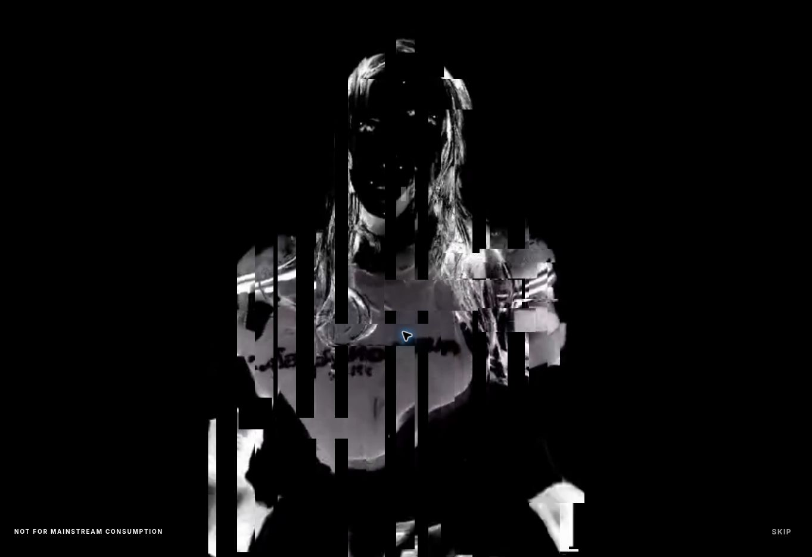

# Fragment entrance prototype

Review route: `/mockups/fragment-entry/`. Use REPLAY INTRO after the first visit to replay. A `?replay=1` entry URL also requests one replay and is removed from history immediately.

This isolated page copies the existing homepage and replaces its fingerprint gate with an original 6.8-second canvas sequence inspired by the fragmentation and audio relationship in Eugene Pylinsky's *Max Cooper — Identity*. No reference artwork, video, or music is embedded. Root homepage and shared layouts are untouched.

## Source and motion

- `silhouette.mp4` is an optimized, muted derivative of the owner's `FRSR_biometric_source_08-13.mp4` (512 × 910, five seconds), delivered as 432 × 768 at 24 fps. The original remains unchanged.
- The logo and final hero are existing repository assets.
- The existing complete site voice recording is reused. Its first ten seconds correlate at 0.99826 with the newly supplied `FASHIONROCKSTAR_ACCESS_GRANTED(2).mp3` after decoding to mono, 8 kHz; it is the same performance in a smaller web encoding.
- ENTER starts voice and footage from a user gesture. Web Audio energy modulates strip displacement. Voice continues over the homepage and can be muted with SOUND ON/OFF. SKIP and Escape stop voice as well as visuals.
- At 3.85 seconds, the existing hero video restarts once beneath the canvas. The final canvas samples that same video at the same geometry; transparent vertical slots expose it at 5.25 seconds. The gate disappears at 6.8 seconds.
- First entry is tracked per tab session. Completing the prototype also marks the preview's old fingerprint session as granted, so navigating to its root does not reintroduce the rejected interaction.

## Resilience

Reduced motion opens the homepage immediately after ENTER, preserving explicitly started audio. Video failure uses the real logo. The gate has an independent bootstrap fail-open timer and an animation completion deadline. Canvas resolution is capped; active compositing runs at 30 fps and stops on completion. Underlying content is inert during the gate; focus is contained and moved to the homepage on completion. Leaving the page cancels the sequence and pauses voice.

This is a review prototype, not a production publish. Desktop Cloud Chrome verification does not establish physical iPhone or Safari behavior.

## Live verification

Verified on Netlify preview code commit `9f6ca1592e813ffefbb5a0ccfde26a5d5bdfe614` in Cloud Chrome:

- ENTER starts the supplied footage and voice; the portrait visibly fragments.
- The gate reaches `complete`, releases page interaction, and leaves the hero and voice playing.
- REPLAY INTRO returns to the entry screen.
- SKIP reaches the homepage immediately and pauses the voice.
- Reloading after completion shows the homepage and replay control without repeating the entrance.
- Local syntax, HTML asset references, and Git whitespace checks passed. The root homepage and shared assets have no changes.

